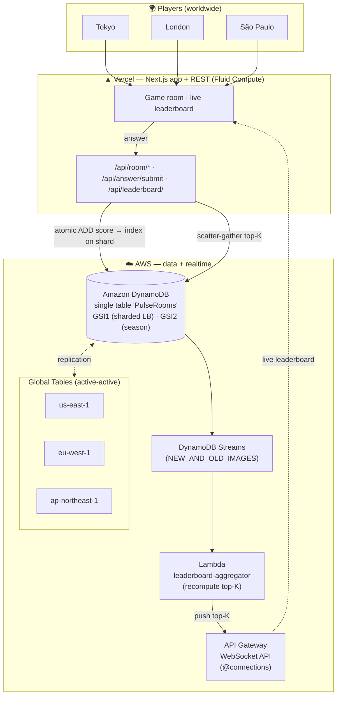
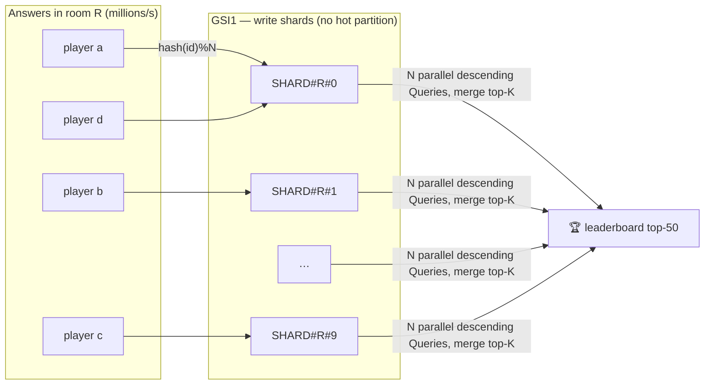
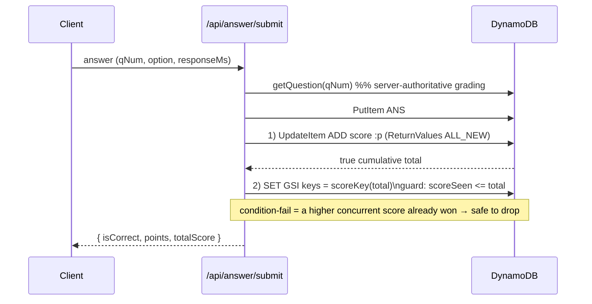

# PulseRooms — Architecture

## System (write path + realtime + multi-region)

## The hot-partition fix (Upgrade #2)

Every answer in a room targets the same room — a naïve leaderboard GSI keyed on
`ROOM#<id>` puts the entire firehose on one partition. We scatter writes across
N shards and gather on read.

## Scoring write order (Upgrade #1 — no race)

## Single-table layout

| Entity | PK | SK | GSI1PK / GSI1SK | GSI2PK / GSI2SK |
|---|---|---|---|---|
| Room | `ROOM#<id>` | `META` | — | — |
| Question | `ROOM#<id>` | `Q#<nnn>` | — | — |
| Player | `ROOM#<id>` | `PLAYER#<pid>` | `SHARD#<id>#<n>` / `SCORE#<padded>` | `SEASON#<s>` / `SCORE#<padded>` |
| Answer | `ROOM#<id>` | `ANS#<pid>#<instance>` | — | — |
| WS conn | `ROOM#<id>` | `CONN#<connId>` | — | — |
| Profile | `PLAYER#<pid>` | `PROFILE` | — | — |
| History | `PLAYER#<pid>` | `ROOM#<id>` | — | — |

See [`lib/keys.ts`](../lib/keys.ts) for the authoritative key construction.
